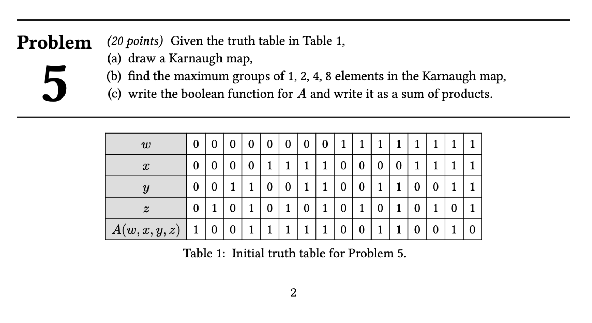

# Kian's Typst Homework Template



A template & library for typesetting homework assignment submissions in Typst.

## Installation

Simply download the `khw.typ` file and import it into your Typst document.

## Usage

See the `examples` directory in this repository for some example usage.

First, import the required functions from the `khw.typ` file:

```typst
#import "khw.typ": khw, problem
```

Next, use a show rule and the `khw()` function to set up the document:

```typst
#show: khw.with(
  title: [Title content],
  course: [Course name],
  author: "Author name",
  newpages: false, // Optional. Whether each problem should start on a new page
  problem-name: "Question", // Optional. What to call each problem
)
```

This will produce a header for your document with the given title, course name,
author name, and the current date.

### Problems

To typeset a problem, use the `problem()` function:

```typst
#problem[
    Problem text, prompt, etc.
]

Problem solution/respose...
```

There are some optional arguments you can pass to the `problem()` function:

```typst
#problem(
    name: string, // What to call the problem, e.g. "Problem" or "Question".
    newpage: true/false/auto, // Whether to begin the problem on a new page. Auto will use the "newpages" setting from the khw() function.
    increment: number, // How much to increment the problem counter by. Default is 1.
    label: Label, // A label for this problem.
)[
    Problem text, prompt, etc.
]
```

### Multi-part problems

To typeset a multi-part problem, use the `parts()` function:

```typst
#problem[Problem text]

#parts[
    *Part 1 prompt*

    Part 1 solution/response...
][
    *Part 2 prompt*

    Part 2 solution/response...
] // ...
```

Just like with problems, the parts are automatically numbered.

### Graphs

The homework template includes a function to generate graph drawings from an edge list.

A good demonstration of how to use it is [in this discussion post](https://github.com/cetz-package/cetz/discussions/552#discussion-6492715).
Also look at `examples/computer-science/problem4.typ`.

The `radialgraph()` function includes a complete documentation comment in `khw.typ`.
Use that to find all the available options and what they do.
